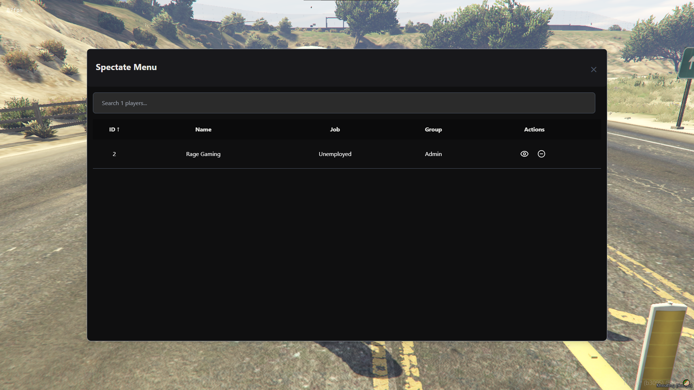
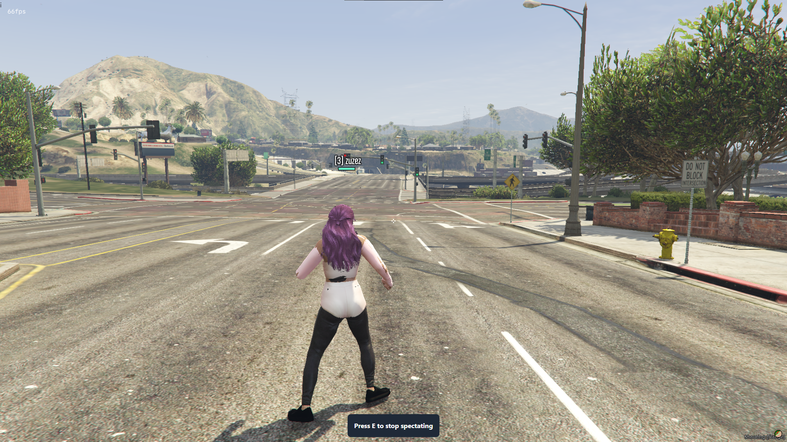
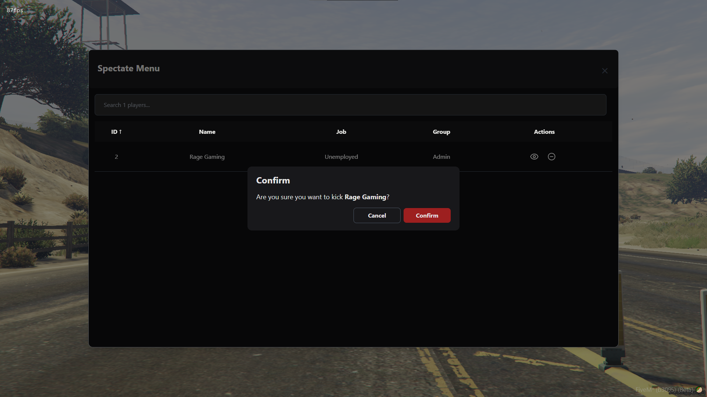
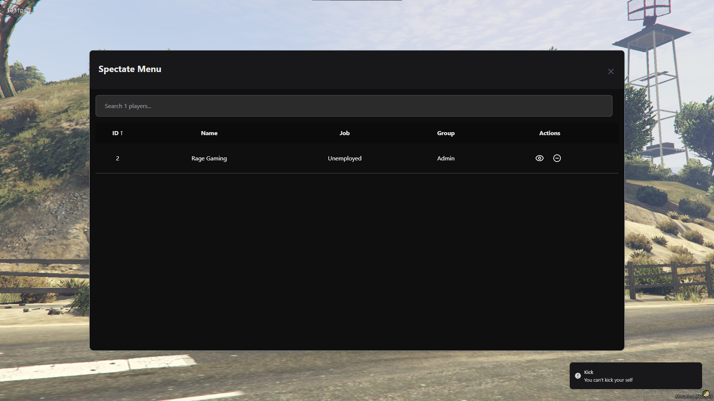

# RAGE_SpectateMenu

Welcome to the RAGE_SpectateMenu repository! This script provides a streamlined and minimalistic admin spectate menu to manage players on your FiveM server efficiently.

## Features
1. **Search Available Players:** Admins can quickly search for available players on the server.

2. **Spectate and Kick:** Admins have the ability to spectate players and kick them if necessary.

3. **Sort Players List:** Admins can sort the players list by various headers such as ID, Name, Jobs, and Group.

4. **Minimal UI:** The user interface is designed to be minimalistic, ensuring ease of use without unnecessary clutter.

5. **Allowed Group Members:** pecify allowed group members in the config to restrict access to admin features.

6. **Configurable:** Easy-to-use configuration file to customize the script according to your server's needs.

## Installation

1. Clone this repository to your FiveM server resources directory:
    ```bash
    git clone https://github.com/Rage-Gaming/RAGE_SpectateMenu.git
    ```

2. Add the script to your server configuration file (server.cfg):

    ```svg
    ensure RAGE_SpectateMenu
    ```
3. Configure the script by editing the config.lua file to suit your requirements.

## Usage

- Open the spectate menu using the designated command (e.g., `/spectatemenu`).

- Use the search bar to find specific players.

- Use the sort headers to organize the player list.

- Select a player to spectate or kick them from the server.

- Configure allowed group members in the `config.lua` file to manage access to admin features.

## Configuration

Edit the `config.lua` file to set up the script according to your preferences. Here is an example configuration:

```lua
Config.AllowedGroups = {
	["admin"] = true,
	-- ["mod"] = false, -- You can add other groups like this
}
```

## Screenshots
- **Main Menu**


- **Spectate**


- **Player kick Confirmation**


- **Notification**



## Contact

If you have any questions or need help, feel free to contact me on Discord: [Join Now](https://discord.gg/bDaYd2P9Vu).

## License

This project is licensed under the LGPL License. See the [LICENCE](https://github.com/Rage-Gaming/RAGE_SpectateMenu/blob/main/LICENSE). file for details.
